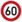

# Build a Traffic Sign Recognition Project

The goals / steps of this project are the following:
* Load the data set (see below for links to the project data set)
* Explore, summarize and visualize the data set
* Design, train and test a model architecture
* Use the model to make predictions on new images
* Analyze the softmax probabilities of the new images
* Summarize the results with a written report

[//]: # (Image References)

[image1]: ./examples/visualization.jpg "Visualization"
[image2]: ./examples/grayscale.jpg "Grayscaling"
[image3]: ./examples/random_noise.jpg "Random Noise"
[image4]: ./german_traffic_signs/60.jpg "Traffic Sign 1"
[image5]: ./german_traffic_signs/noentry.jpg "Traffic Sign 2"
[image6]: ./german_traffic_signs/priority.jpg "Traffic Sign 3"
[image7]: ./german_traffic_signs/stop.jpg "Traffic Sign 4"
[image8]: ./german_traffic_signs/right.jpg "Traffic Sign 5"

## Rubric Points
Here I will consider the [rubric points](https://review.udacity.com/#!/rubrics/481/view) individually and describe how I addressed each point in my implementation.  

---
### Writeup / README

#### 1. Provide a Writeup / README that includes all the rubric points and how you addressed each one. You can submit your writeup as markdown or pdf. You can use this template as a guide for writing the report. The submission includes the project code.

You're reading it! And here is a link to my [project code](https://github.com/lealldiogo/CarND-Traffic-Sign-Classifier-Project_EC2/blob/master/Traffic_Sign_Classifier.ipynb)

### Data Set Summary & Exploration

#### 1. Provide a basic summary of the data set. In the code, the analysis should be done using python, numpy and/or pandas methods rather than hardcoding results manually.

I used the basic python methods summary statistics of the traffic signs data set:

* The size of training set is **34799**
* The size of the validation set is **4410**
* The size of test set is **12630**
* The shape of a traffic sign image is **32x32x3**
* The number of unique classes/labels in the data set is **43**

#### 2. Include an exploratory visualization of the dataset.

Here is an exploratory visualization of the data set. In this section I really just plotted the images to see what they were like. 

Not much exploration was done here actually. I preferred to save the images as JPG files and to explore each of the default image viewer in my machine. This helped me later when chosing which  images to download from the web.

### Design and Test a Model Architecture

#### 1. Describe how you preprocessed the image data. What techniques were chosen and why did you choose these techniques? Consider including images showing the output of each preprocessing technique. Pre-processing refers to techniques such as converting to grayscale, normalization, etc.

I preprocessed the data set by normalizing it between -0.5 and 0.5. This was achieved by dividing the image pixels by 255, which normalizes the image between 0 and 1, and then subtracted 0.5.

By only normalizing the images, I started to achieve very good results.

#### 2. Describe what your final model architecture looks like including model type, layers, layer sizes, connectivity, etc.) Consider including a diagram and/or table describing the final model.

My final model consisted of the following layers:

| Layer         		|     Description	        					| 
|:---------------------:|:---------------------------------------------:| 
| Input         		| 32x32x3 RGB image   							| 
| Convolution 5x5     	| 1x1 stride, valid padding, outputs 28x28x12 	|
| RELU					|												|
| Max pooling	      	| 2x2 stride, outputs 14x14x12 				|
| Convolution 3x3	    | 1x1 stride, valid padding, outputs 12x12x48 	|
| RELU					|												|
| Max pooling	      	| 2x2 stride, outputs 6x6x48 				|
| Convolution 1x1	    | 1x1 stride, valid padding, outputs 6x6x192 	|
| RELU					|												|
| Dropout		| 0.5 of keep probability    									|
| RELU					|												|
| Flatten					|	outputs 6912											|
| Fully connected		| outputs 1728       									|
| RELU					|												|
| Fully connected		| outputs 432       									|
| RELU					|												|
| Fully connected		| outputs 108       									|
| RELU					|												|
| Fully connected		| outputs 43       									|

#### 3. Describe how you trained your model. The discussion can include the type of optimizer, the batch size, number of epochs and any hyperparameters such as learning rate.

To train the model, I used an .... adam optimizer

#### 4. Describe the approach taken for finding a solution and getting the validation set accuracy to be at least 0.93. Include in the discussion the results on the training, validation and test sets and where in the code these were calculated. Your approach may have been an iterative process, in which case, outline the steps you took to get to the final solution and why you chose those steps. Perhaps your solution involved an already well known implementation or architecture. In this case, discuss why you think the architecture is suitable for the current problem.

My final model results were:
* training set accuracy of 99.2%
* validation set accuracy of 93.8%
* test set accuracy of 92.5%

I chose first tried the LeNet architecture on the model since I used it in another lab and was familiar with the model, and also because the model has proven your efficacy over similar data (letters from the alphabet).

* What were some problems with the initial architecture? The LeNet architecture was able to achieve good results but not the required one. So I decided to change a the model just a bit
* How was the architecture adjusted and why was it adjusted? Typical adjustments could include choosing a different model architecture, adding or taking away layers (pooling, dropout, convolution, etc), using an activation function or changing the activation function. One common justification for adjusting an architecture would be due to overfitting or underfitting. A high accuracy on the training set but low accuracy on the validation set indicates over fitting; a low accuracy on both sets indicates under fitting.
* Which parameters were tuned? How were they adjusted and why?
* What are some of the important design choices and why were they chosen? For example, why might a convolution layer work well with this problem? How might a dropout layer help with creating a successful model?

* How does the final model's accuracy on the training, validation and test set provide evidence that the model is working well?
 

### Test a Model on New Images

#### 1. Choose five German traffic signs found on the web and provide them in the report. For each image, discuss what quality or qualities might be difficult to classify.

Here are five German traffic signs that I found on the web:

    

All five images were taken from the wikipedia page [Road signs in Germany](https://en.wikipedia.org/wiki/Road_signs_in_Germany). All of them had to be converted from SVG to JPG and resized. For that, Imagemagick was used.

When I first evaluated the accuracy of the images, my model wasn't able to predict correctly any of the traffic signs. Noticing that the new images were fitting to its borders, without any paddings around it, I decided to deeply investigate the images from the data set and discovered that even though the dimension of the borders of the images varied a bit, all of them had some padding.

This observation led me to add 5 pixels of padding in each image using the copyMakeBorder OpenCV function. I chose to use the border type constant of color black.

#### 2. Discuss the model's predictions on these new traffic signs and compare the results to predicting on the test set. At a minimum, discuss what the predictions were, the accuracy on these new predictions, and compare the accuracy to the accuracy on the test set.

Here are the results of the prediction:

| Image			        |     Prediction	        					| 
|:---------------------:|:---------------------------------------------:| 
| Keep right      		| Keep right   									| 
| Priority road     			| Priority road 										|
| No entry					| No entry										|
| Stop	      		| Stop					 				|
| Speed limit (60km/h)			| Speed limit (60km/h)      							|

The model was able to correctly guess all 5 of the traffic signs! Which gives an impressive accuracy of 100%. This compares favorably to the accuracy on the test set of 92.5%. I believe that the accuracy here was even better mostly because of the images I chose and the preprocess I run over them to make them easy for the model to predict.

#### 3. Describe how certain the model is when predicting on each of the five new images by looking at the softmax probabilities for each prediction. Provide the top 5 softmax probabilities for each image along with the sign type of each probability.

The code for making predictions on my final model is located in the 16th cell of the Ipython notebook.

For all of the new images, the model was very sure of each traffic sign (probability of approximately 1), and it did get all of the new traffic signs correctly. The top three soft max probabilities for the first image were:

| Probability         	|     Prediction	        					| 
|:---------------------:|:---------------------------------------------:| 
| 1.00000000e+00          			| Keep right   									| 
| 9.36095467e-34     				| Turn left ahead 										|
| 2.52720086e-38					| Wild animals crossing											|

The top three soft max probabilities for the second image were:

| Probability         	|     Prediction	        					| 
|:---------------------:|:---------------------------------------------:| 
| 1.00000000e+00            			| Priority road   									| 
| 9.74120162e-09     				| Keep right 										|
| 1.12895573e-13					| No entry										|

For the third image were:

| Probability         	|     Prediction	        					| 
|:---------------------:|:---------------------------------------------:| 
| 1.00000000e+00           			| No entry   									| 
| 1.22637783e-12     				| Stop 										|
| 6.45008976e-22					| Speed limit (20km/h)											|

Fourth image:

| Probability         	|     Prediction	        					| 
|:---------------------:|:---------------------------------------------:| 
| 9.99994516e-01          			| Stop   									| 
| 5.46543379e-06     				| No entry 										|
| 1.78296179e-15					| Speed limit (20km/h) 										|

Fifth Image:

| Probability         	|     Prediction	        					| 
|:---------------------:|:---------------------------------------------:| 
| 1.00000000e+00           			| Speed limit (60km/h)   									| 
| 6.28259939e-30     				| Speed limit (50km/h) 										|
| 2.05849705e-32					| Speed limit (80km/h)										|
